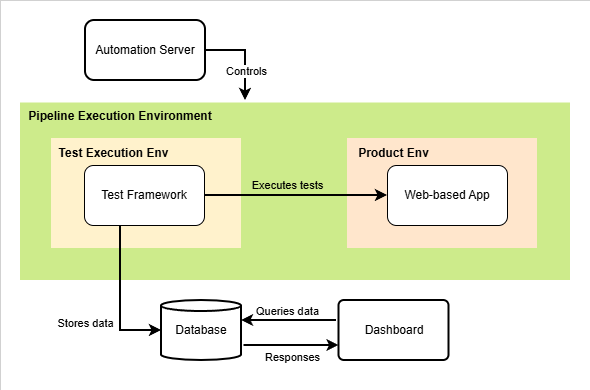

# Overview

**akiro** is the infrastructure repository for the Automated Testing Infrastructure (ATI) - a self-hosted system that orchestrates automated test execution, environment provisioning, result processing, and quality monitoring.

This repository contains the Jenkins pipeline definition, persistent service configurations, browser driver images, and Grafana dashboard sources that form the operational backbone of the ATI.

---

## What This Repository Contains

| Path | Purpose |
|------|---------|
| `Jenkinsfile` | Pipeline definition for all execution modes (push, nightly, manual) |
| `JenkinsPipelineConfiguration.md` | Jenkins setup guide: credentials, webhook, cron, and Smee.io relay |
| `akiro-persist-containers/` | Docker Compose for persistent infra services (InfluxDB, Grafana, Devpi, Verdaccio) |
| `grafana-source/` | Exported Grafana dashboard JSON files and import guide |
| `pythonwdriver/` | Dockerfiles for Python + browser driver images used by the test framework container |

---

## Related Repositories

| Repository | Role |
|------------|------|
| [devtest](https://github.com/bienxhuy/devtest.git) | Test framework — pytest-based API, E2E, and performance suites; post-execution processing and InfluxDB ingestion layer |
| [quotie](https://github.com/bienxhuy/quotie.git) | System Under Test — full-stack web application (React, Node.js, PostgreSQL) serving as the validation target for the ATI |

The pipeline defined in this repository clones both `devtest` and `quotie` at runtime into isolated Docker containers. Neither repository needs to be set up manually on the host machine.

---

## System Overview

**High Level Design**



**Main Flow:**

```
GitHub Push / Manual Trigger / Cron
        │
        ▼
    Jenkins job (akiro)
        │
        ├── Provisions product environment (SUT containers: backend, frontend, PostgreSQL)
        ├── Provisions test environment (devtest container: API, E2E, performance)
        │
        ├── Executes test suites (scope depends on execution mode)
        ├── Retries failures, classifies results (passed / failed / unstable)
        ├── Summarizes & extracts information
        ├── Writes structured metrics to InfluxDB
        │
        └── Tears down all containers, archives artifacts
                │
                ▼
        Grafana Dashboard (5 pages: build health → suite detail → test detail)
```

**Execution Modes**

| Mode | Trigger | Suites Executed |
|------|---------|-----------------|
| Push | GitHub webhook | Unit, API |
| Nightly | Cron schedule | Unit, API, E2E, Performance |
| Manual | Jenkins UI | Unit, API, E2E, Performance |

---

## Host Requirements

The following must be installed and running on the host machine before using this repository, the exact version that the author used will also be shown:

- Docker Engine (v28.3.2)
- Jenkins (with Generic Webhook Trigger plugin installed) (v2.516.1)
- Smee.io client (for webhook relay from GitHub to local Jenkins) (v4.3.1)
- Node.js (for SUT dependency resolution via Verdaccio) (v22.16.0)
- Python 3.12+ (for test framework dependency resolution via Devpi) (v3.12.10)

Refer to `JenkinsPipelineConfiguration.md` for Jenkins-specific setup steps and `akiro-persist-containers/` for starting the persistent infrastructure services.

---

## Quick Start

1. Clone this repository onto the Jenkins host machine.
2. Start persistent services: see `akiro-persist-containers/README.md`.
3. Build the Python + browser driver image: see `pythonwdriver/README.md`.
4. Import Grafana dashboards: see `grafana-source/README.md`.
5. Configure Jenkins: see `JenkinsPipelineConfiguration.md`.
6. Point the Jenkins pipeline to this repository's `Jenkinsfile`.
