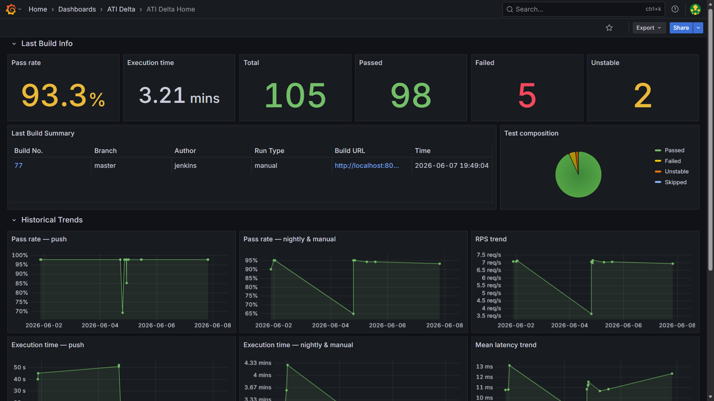
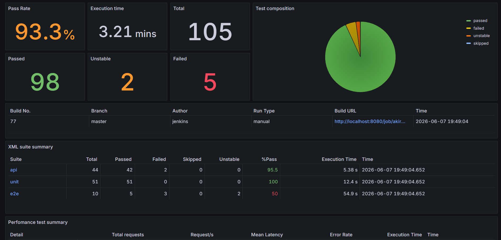
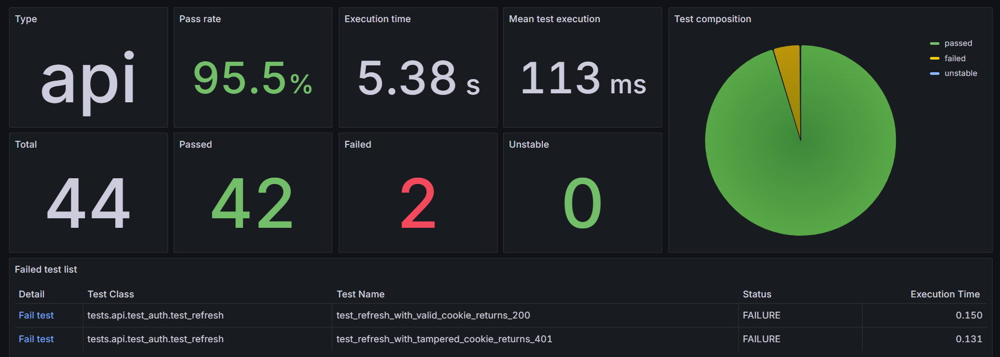
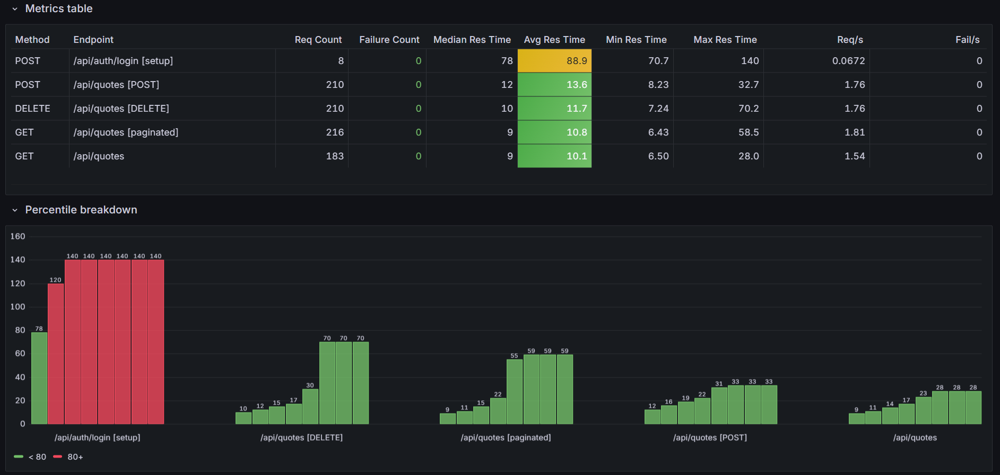
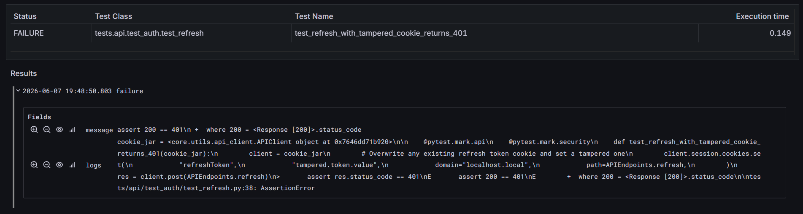

# Grafana Source

This directory contains the exported JSON files for all ATI dashboard pages, along with instructions for connecting InfluxDB as a data source and importing the dashboards.

---

## Dashboard Pages

| File | Dashboard page | Purpose |
|------|---------------|---------|
| `home.json` | Home | Latest build health and historical pass rate / execution time trends |
| `build-detail.json` | Build detail | Single build overview with per-suite breakdown |
| `xml-suite-detail.json` | XML suite detail | Failed and unstable test list for a selected functional suite |
| `performance-detail.json` | Performance detail | Load test metrics: RPS, latency percentiles, error rate, per-endpoint breakdown |
| `test-detail.json` | Test detail | Failure message and execution logs for a single failing test |

Navigation between pages is handled automatically via Grafana data links — clicking a build ID, suite, or test row on one page passes the relevant context variable to the next.

---

## Step 1 — Configure InfluxDB Data Source

1. Open Grafana at [http://localhost:9090](http://localhost:9090) and log in.
2. Go to **Connections → Data sources → Add new data source**.
3. Select **InfluxDB**.
4. Configure the data source with the following values:

| Field | Value |
|-------|-------|
| Name | `InfluxDB` |
| Query language | `SQL` |
| URL | `http://influxdb3:8181` |
| Token | Your InfluxDB API token (same as `influxdb-token` in Jenkins Credentials; see [InfluxDB Access](../akiro-persist-containers/README.md#influxdb-access)) |
| Database | `devtest_metrics` |
| Insecure Connection | toggle ON |

5. Click **Save & Test**. You should see a confirmation that the data source is working.

> The URL `http://influxdb3:8181` works when Grafana and InfluxDB are on the same Docker network (as configured in `../persist-containers/docker-compose.yml`). If running Grafana outside Docker, use `http://localhost:8181` instead.

---

## Step 2 — Replace Datasource UID in Dashboard JSON Files

The dashboard JSON files use the placeholder `abcxyz-influxdb-datasource-to-be-replaced` for the InfluxDB datasource UID. Replace it with the actual UID assigned to your datasource before importing.

1. Find your datasource UID in Grafana: go to **Connections → Data sources → InfluxDB** and copy the UID from the browser URL bar (the string after `/edit/`).

2. In the `grafana-source/dashboard-srcs/` directory, run the following command to replace the placeholder in all JSON files:

   **Windows PowerShell:**
```powershell
foreach ($f in Get-ChildItem *.json) { $c = Get-Content $f.FullName -Raw; $c = $c -replace 'abcxyz-influxdb-datasource-to-be-replaced', 'YOUR_UUID'; Set-Content $f.FullName $c }
```

---

## Step 3 — Import Dashboard Pages

Import each JSON file individually:

1. In Grafana, go to **Dashboards → New → Import**.
2. Click **Upload dashboard JSON file** and select a file from this directory.
3. Click **Import**.

Repeat for all five JSON files. The recommended import order follows the navigation hierarchy:

1. `home.json`
2. `build-detail.json`
3. `xml-suite-detail.json`
4. `performance-detail.json`
5. `test-detail.json`

> After importing, dashboards will show "No data" because the database currently has no data or schema. This will resolve after the first successful pipeline run.

## Appendix

**Home detail page**



**Build detail page**



**XML suite detail page**



**Perfomance detail page**



**Failed test detail page**


